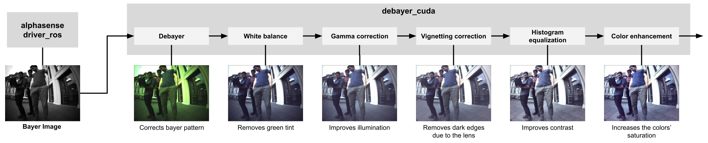

# RAW Image Pipeline

Image processing utilities used for cameras that provide RAW data, such as the Alphasense Core unit.


**Maintainers:** Matias Mattamala (matias@robots.ox.ac.uk)

**Contributors:** Matias Mattamala, Timon Homberger, Marco Tranzatto, Samuel Zimmermann, Lorenz Wellhausen, Shehryar Khattak, Gabriel Waibel


## License
This source code is released under a [proprietary license](LICENSE).

## Build

[](https://ci.leggedrobotics.com/job/bitbucket_leggedrobotics/job/alphasense_rsl/job/master/)

## Overview
### Alphasense setup
Please refer to [**Alphasense Setup**](docs/alphasense_setup.md) for the instructions to setup the host PC where the Alphasense will be connected.
For further information you can refer the [official manual](https://github.com/sevensense-robotics/alphasense_core_manual/).

### Packages
1. **`raw_image_pipeline`**: ROS-independent implementation of the pipeline.
2. **`raw_image_pipeline_python`**: Python bindings for `raw_image_pipeline`.
3. **`raw_image_pipeline_ros`**: ROS interface to run the processing pipeline.
4. **`raw_image_pipeline_white_balance`**: Additional white balance algorithm built upon Shane Yuan's [code](https://github.com/yuanxy92/AutoWhiteBalance), based on Barron's ([1](https://arxiv.org/abs/1507.00410), [2](https://arxiv.org/abs/1611.07596)).

## Requirements and compilation
### Dependencies

```sh
sudo apt install libyaml-cpp-dev
```

```sh
cd ~/git
git clone git@github.com:catkin/catkin_simple.git
git clone git@github.com:ethz-asl/glog_catkin.git
git clone git@github.com:mmattamala/pybind11_catkin.git
cd ~/catkin_ws/src
ln -s ../../git/catkin_simple .
ln -s ../../git/glog_catkin .
ln -s ../../git/pybind11_catkin .
```

If you need CUDA support, you need to build OpenCV with CUDA. Check the [instructions below](#cuda-support)

### Build raw_image_pipeline_ros

To build the ROS package:
```sh
catkin build raw_image_pipeline_ros
```

If you also need the Python bindings, run:
```sh
catkin build raw_image_pipeline_python
```

### CUDA support
If you are using a Jetson or another GPU-enabled computer and want to exploit the GPU, you need to compile OpenCV with CUDA support. Clone the [opencv_catkin](https://github.com/ori-drs/opencv_catkin) package, which setups **OpenCV 4.2 by default**.
```sh
cd ~/git
git clone git@github.com:ori-drs/opencv_catkin.git
cd ~/catkin_ws/src
ln -s ../../git/opencv_catkin .
cd ~/catkin_ws
```

> :warning: Before compiling, you need to confirm the _compute capability_ of your NVidia GPU, which you can check in [this website](https://developer.nvidia.com/cuda-gpus) or the [CUDA wikipedia page](https://en.wikipedia.org/wiki/CUDA).

#### Compilation on Jetson Xavier board (compute capability 7.2)
```
catkin build opencv_catkin --cmake-args -DCUDA_ARCH_BIN=7.2
source devel/setup.bash
```

#### Compilation on Jetson Orin board (compute capability 8.7)
```
catkin build opencv_catkin --cmake-args -DCUDA_ARCH_BIN=8.7
source devel/setup.bash
```

#### Compilation on other platforms (e.g. laptops, desktops)
There are some extra considerations if you plan to compile OpenCV with CUDA in your working laptop/desktop:
1. **Compute capability may be different for your GPU:** Please check the aforementioned websites to set the flag correctly.
2. **The opencv_catkin default flags are the minimum:** Graphical support libraries (such as GTK) are disabled, so you cannot use methods such as `cv::imshow`. If you want to enable it, you can check the flags in the CMakeLists of `opencv_catkin`
3. **Default OpenCV version is 4.2:** The package installs by default OpenCV 4.2, which was the version compatible with ROS melodic. This can be changed by modyfing the CMakeLists of `opencv_catkin` as well.

OpenCV's compilation will take a while - get a coffee in the meantime. When it's done, you can rebuild `raw_image_pipeline_ros`.


### Troubleshooting
* If you get errors due to `glog`, remove `glog_catkin`, compile `opencv_catkin` using the system's glog, and _then_ build `raw_image_pipeline_ros` (which will compile `glog_catkin`)
* If OpenCV fails due to CUDA errors, confirm that you compiled using the right compute capability for your GPU.
* If you are using older versions of CUDA (10.x and before), they may require older GCC versions. For example, to use GCC 7 you can use:
``` sh
catkin build opencv_catkin --cmake-args -DCUDA_ARCH_BIN=<your_compute_capability> -DCMAKE_C_COMPILER=/usr/bin/gcc-7
```

## Run the node
To run, we use the same launch file as before:
```sh
roslaunch raw_image_pipeline_ros raw_image_pipeline_node.launch
```

This launchfile was setup for Alphasense cameras. The parameters can be inspected in the [launch file itself](raw_image_pipeline_ros/launch/raw_image_pipeline_node.launch).


## Pipeline explanation

The `raw_image_pipeline` pipeline implements the following structure:



Modules can be disabled (except debayer) and the image will be processed by the subsequent modules. The modules available are:
* **Debayer**: `auto`, `bayer_bggr8`, `bayer_gbrg8`, `bayer_grbg8`, `bayer_rggb8`
* **white balance**: `simple`, `grey_world`, `learned` (from [OpenCV](https://docs.opencv.org/4.x/df/db9/namespacecv_1_1xphoto.html)), `ccc` (from `raw_image_pipeline_white_balance` package), `pca` (custom implementation)
* **Gamma correction**: `default` (from OpenCV), `custom` (custom implementation)
* **Vignetting correction**: Removes the darkening effect of the lens toward the edges of the image by applying a polynomial mask.
* **Color enhancement**: Converts the image to HSV and applies a gain to the S (saturation) channel.
