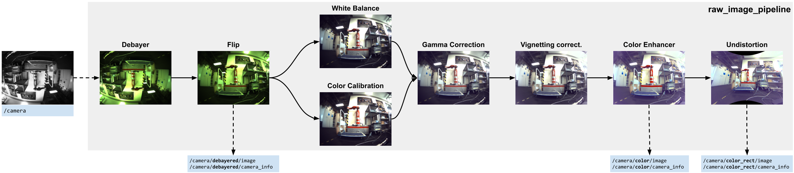

# RAW Image Pipeline

Image processing utilities used for cameras that provide RAW data, such as the Alphasense Core unit.

**Maintainers:** Matias Mattamala (matias@robots.ox.ac.uk)

**Contributors:** Matias Mattamala, Timon Homberger, Marco Tranzatto, Samuel Zimmermann, Lorenz Wellhausen, Shehryar Khattak, Gabriel Waibel




## License
This source code is released under a [MIT License](LICENSE).

`raw_image_pipeline_white_balance` relies on Shane Yuan's [AutoWhiteBalance package](https://github.com/yuanxy92/AutoWhiteBalance) licensed under [GNU](raw_image_pipeline_white_balance/LICENSE).

`raw_image_pipeline_python` relies on Pascal Thomet's [cvnp](https://github.com/pthom/cvnp), licensed under [MIT](raw_image_pipeline_python/thirdparty/cvnp/LICENSE) as well.


## Build

[](https://ci.leggedrobotics.com/job/bitbucket_leggedrobotics/job/alphasense_rsl/job/master/)

## Overview
### Packages
1. **`raw_image_pipeline`**: ROS-independent implementation of the pipeline.
2. **`raw_image_pipeline_python`**: Python bindings for `raw_image_pipeline`.
3. **`raw_image_pipeline_ros`**: ROS interface to run the processing pipeline.
4. **`raw_image_pipeline_white_balance`**: Additional white balance algorithm built upon Shane Yuan's [code](https://github.com/yuanxy92/AutoWhiteBalance), based on Barron's ([1](https://arxiv.org/abs/1507.00410), [2](https://arxiv.org/abs/1611.07596)).

## Pipeline

The package implements diferent modules that are chained together to process the RAW images. Each can be disabled and the image will be processed by the subsequent modules.
* **Debayer**: `auto`, `bayer_bggr8`, `bayer_gbrg8`, `bayer_grbg8`, `bayer_rggb8`
* **Flip**: Flips the image 180 degrees
* **White balance**: `simple`, `grey_world`, `learned` (from [OpenCV](https://docs.opencv.org/4.x/df/db9/namespacecv_1_1xphoto.html)), `ccc` (from `raw_image_pipeline_white_balance` package), `pca` (custom implementation)
* **Color correction**: Simple color correction based on a mixing BGR 3x3 matrix.
* **Gamma correction**: `default` (from OpenCV), `custom` (custom implementation)
* **Vignetting correction**: Removes the darkening effect of the lens toward the edges of the image by applying a polynomial mask.
* **Color enhancement**: Converts the image to HSV and applies a gain to the S (saturation) channel.
* **Undistortion**: Corrects the image given the camera calibration file.


<details>

<summary>
Detailed modules description
</summary>

### Debayer Module
This module demosaics a Bayer-encoded image into BGR values (following OpenCV's convention). It relies on OpenCV's methods for both CPU and GPU.

**Parameters**
- `debayer/enabled`: Enables the module. `True` by default
- `debayer/encoding`: Encoding of the incoming image. `auto` uses the encoding field of the ROS message
  - Values: `auto`, `bayer_bggr8`, `bayer_gbrg8`, `bayer_grbg8`, `bayer_rggb8`

### Flip
This flips the image 180 degrees. Just that.

**Parameters**
- `debayer/enabled`: Enables the module. `False` by default

### White Balance
It automatically corrects white balance using different available algorithms.

**Parameters**
- `white_balance/enabled`: Enables the module. `False` by default
- `white_balance/method`: To select the method used for automatic white balance
  - `simple`: from [OpenCV](https://docs.opencv.org/4.x/df/db9/namespacecv_1_1xphoto.html). Tends to saturate colors depending on the clipping percentile.
  - `grey_world`: from [OpenCV](https://docs.opencv.org/4.x/df/db9/namespacecv_1_1xphoto.html)
  - `learned`: from [OpenCV](https://docs.opencv.org/4.x/df/db9/namespacecv_1_1xphoto.html)
  - `ccc`: from `raw_image_pipeline_white_balance` package
  - `pca`: custom implementation
- `white_balance/clipping_percentile`: Used in `simple` method
  - Values: between 0 and 100
- `white_balance/saturation_bright_thr`: Used in `grey_world`, `learned` and `ccc` methods
  - Values: Between 1.0 and 0.0. E.g. 0.8 means that all the values above 0.8*255 (8 bit images) are discarded for white balance determination.
- `white_balance/clipping_percentile`: Used in `simple` method
  - Values: Between 1.0 and 0.0. E.g. 0.2 means that all the values below 0.2*255 (8 bit images) are discarded.
- `white_balance/temporal_consistency`: Only for `ccc`. `False` by default. It uses a Kalman filter to smooth the illuminant estimate.

### Color calibration
It applies a fixed affine transformation to each BGR pixel to mix and add a bias term to the color channels. It can be a replacement for the white balance module.

- `color_calibration/enabled`: Enables the module. `False` by default
- `color_calibration/calibration_file`: A YAML file with the color calibration matrix and bias. Example [file](raw_image_pipeline/config/alphasense_color_calib_example.yaml). This file can be obtained using a script in the `raw_image_pipeline_python` package: [`color_calibration.py`](raw_image_pipeline_python/scripts/color_calibration.py). To run it, we require a set of images capturing a calibration board ([example](raw_image_pipeline_python/config/color_calibration_checker.pdf)): a reference image `ref.png` ([example](raw_image_pipeline_python/config/color_ref.jpg)) and a collection of images from the camera to be calibrated. The usage is:

```sh
color_calibration.py [-h] -i INPUT -r REF [-o OUTPUT_PATH] [-p PREFIX] [--loss LOSS] [--compute_bias]

Performs color calibration between 2 images, using ArUco 4X4

optional arguments:
  -h, --help            show this help message and exit
  -i INPUT, --input INPUT
                        Input image (to be calibrated), or folder with reference images
  -r REF, --ref REF     Reference image to perform the calibration
  -o OUTPUT_PATH, --output_path OUTPUT_PATH
                        Output path to store the file. Default: current path
  -p PREFIX, --prefix PREFIX
                        Prefix for the calibration file. Default: none
  --loss LOSS           Loss used in the optimization. Options: 'linear', 'soft_l1', 'huber', 'cauchy', 'arctan'
  --compute_bias        If bias should be computed
```

> :warning: This feature is experimental and it is not recommended for 'serious' applications.

### Gamma correction
It applies a gamma correction to improve illumination.

**Parameters**
- `gamma_correction/enabled`: Enables the module. `False` by default
- `gamma_correction/method`: To select the method used for automatic white balance
  - `default`: correction from OpenCV (CUDA only)
  - `custom`: a custom implementation based on a look-up table.
-  `gamma_correction/k`: Gamma factor: >1 is a forward gamma correction that makes the image darker; <1 is an inverse correction that increases brightness.
### Vignetting correction
It applies a polynomial illumination compensation to overcome the barrel effect of wide-angle lenses:
`s * (r^2 * a2 + r^4 * a4)`, with `r` the distance to the image center.

**Parameters**
- `vignetting_correction/enabled`: Enables the module. `False` by default
- `vignetting_correction/scale`: s value
- `vignetting_correction/a2`: 2nd-order factor
- `vignetting_correction/a4`: 4th-order factor

> :warning: This feature is experimental and it is not recommended for 'serious' applications.

### Color enhancement
It increases the saturation of the colors by transforming the image to HSV and applying a linear gain.

**Parameters**
- `vignetting_correction/enabled`: Enables the module. `False` by default
- `vignetting_correction/saturation_gain`: A factor to increase the saturation channel of the HSV channel.


### Undistortion
It undistorts the image follow a pinhole model. It requires the intrinsic calibration from Kalibr.

- `color_calibration/enabled`: Enables the module. `False` by default
- `color_calibration/calibration_file`: Camera calibration from Kalibr, following the format of the [example file](raw_image_pipeline/config/alphasense_calib_1.6mp_example.yaml)

</details>


## Requirements and compilation
### Dependencies

```sh
sudo apt install libyaml-cpp-dev
```

```sh
cd ~/git
git clone git@github.com:catkin/catkin_simple.git
git clone git@github.com:ethz-asl/glog_catkin.git
git clone git@github.com:leggedrobotics/pybind11_catkin.git
cd ~/catkin_ws/src
ln -s ../../git/catkin_simple .
ln -s ../../git/glog_catkin .
ln -s ../../git/pybind11_catkin .
```

If you need CUDA support, you need to build OpenCV with CUDA. Check the [instructions below](#cuda-support)

### Build raw_image_pipeline_ros

To build the ROS package:
```sh
catkin build raw_image_pipeline_ros
```

If you also need the Python bindings, run:
```sh
catkin build raw_image_pipeline_python
```

### CUDA support
If you are using a Jetson or another GPU-enabled computer and want to exploit the GPU, you need to compile OpenCV with CUDA support. Clone the [opencv_catkin](https://github.com/ori-drs/opencv_catkin) package, which setups **OpenCV 4.2 by default**.
```sh
cd ~/git
git clone git@github.com:ori-drs/opencv_catkin.git
cd ~/catkin_ws/src
ln -s ../../git/opencv_catkin .
cd ~/catkin_ws
```

> :warning: Before compiling, you need to confirm the _compute capability_ of your NVidia GPU, which you can check in [this website](https://developer.nvidia.com/cuda-gpus) or the [CUDA wikipedia page](https://en.wikipedia.org/wiki/CUDA).

#### Compilation on Jetson Xavier board (compute capability 7.2)
```
catkin build opencv_catkin --cmake-args -DCUDA_ARCH_BIN=7.2
source devel/setup.bash
```

#### Compilation on Jetson Orin board (compute capability 8.7)
```
catkin build opencv_catkin --cmake-args -DCUDA_ARCH_BIN=8.7
source devel/setup.bash
```

#### Compilation on other platforms (e.g. laptops, desktops)
There are some extra considerations if you plan to compile OpenCV with CUDA in your working laptop/desktop:
1. **Compute capability may be different for your GPU:** Please check the aforementioned websites to set the flag correctly.
2. **The opencv_catkin default flags are the minimum:** Graphical support libraries (such as GTK) are disabled, so you cannot use methods such as `cv::imshow`. If you want to enable it, you can check the flags in the CMakeLists of `opencv_catkin`
3. **Default OpenCV version is 4.2:** The package installs by default OpenCV 4.2, which was the version compatible with ROS melodic. This can be changed by modyfing the CMakeLists of `opencv_catkin` as well.

OpenCV's compilation will take a while - get a coffee in the meantime. When it's done, you can rebuild `raw_image_pipeline_ros`.


#### Troubleshooting
* If you get errors due to `glog`, remove `glog_catkin`, compile `opencv_catkin` using the system's glog, and _then_ build `raw_image_pipeline_ros` (which will compile `glog_catkin`)
* If OpenCV fails due to CUDA errors, confirm that you compiled using the right compute capability for your GPU.
* If you are using older versions of CUDA (10.x and before), they may require older GCC versions. For example, to use GCC 7 you can use:
``` sh
catkin build opencv_catkin --cmake-args -DCUDA_ARCH_BIN=<your_compute_capability> -DCMAKE_C_COMPILER=/usr/bin/gcc-7
```

## Run the node
To run, we use the same launch file as before:
```sh
roslaunch raw_image_pipeline_ros raw_image_pipeline_node.launch
```

This launchfile was setup for Alphasense cameras. The parameters can be inspected in the [launch file itself](raw_image_pipeline_ros/launch/raw_image_pipeline_node.launch).

## Alphasense-specific info
### Setup
Please refer to [**Alphasense Setup**](docs/alphasense_setup.md) for the instructions to setup the host PC where the Alphasense will be connected.
For further information you can refer the [official manual](https://github.com/sevensense-robotics/alphasense_core_manual/).
